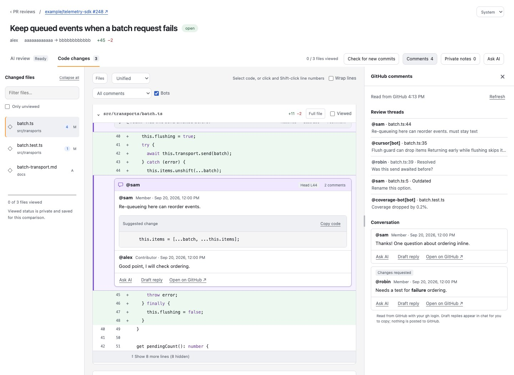
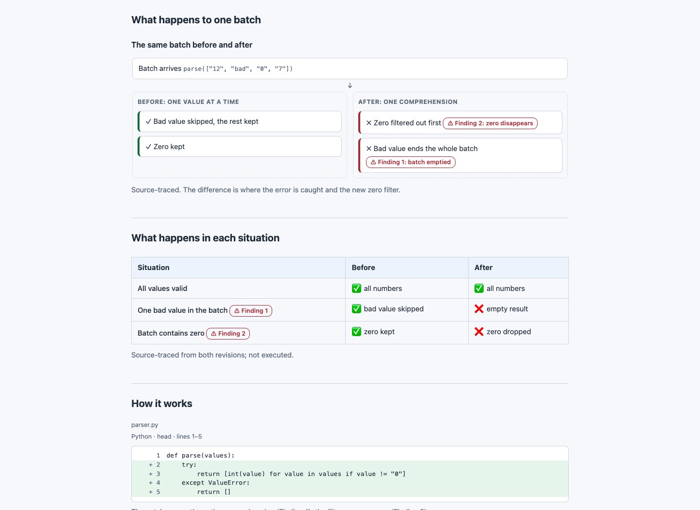
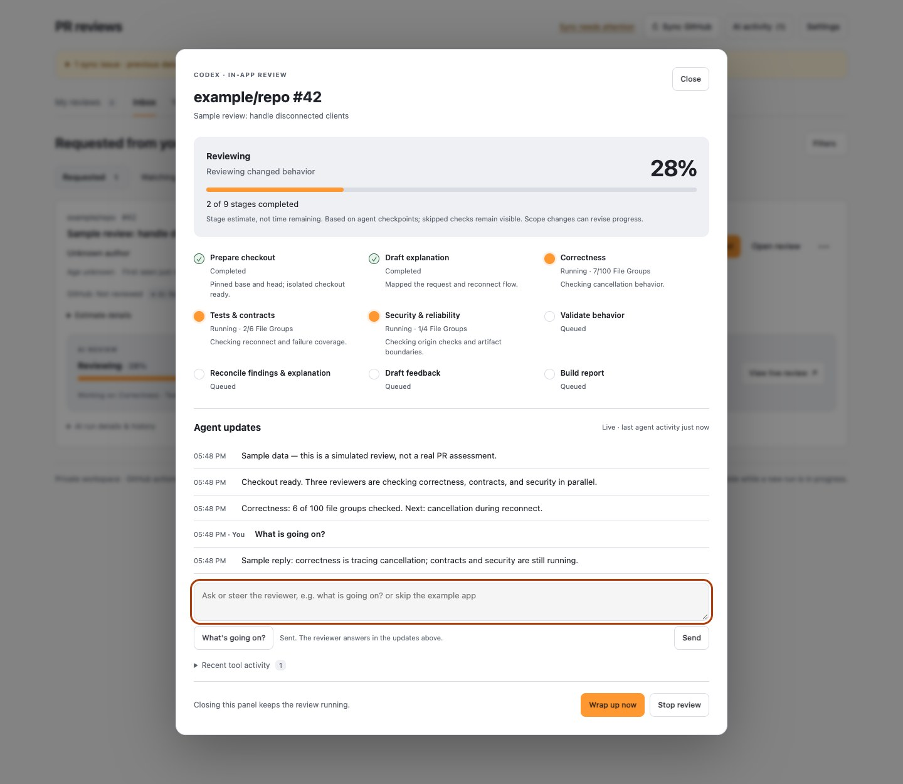
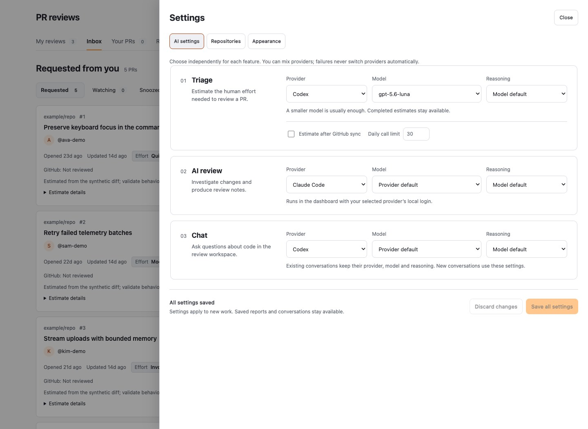

# PR Review Skill

A local dashboard and AI review skill for GitHub pull requests. Find what needs
your attention, understand a change, inspect its code and discussion, and turn
verified findings into review comments you can edit and post yourself.

Use the dashboard with your GitHub CLI login. Add Codex or Claude Code for AI
reviews, effort estimates and code chat. You can also run the review skill
directly from an AI coding agent, without the dashboard.

The app runs on your machine: a Python server with plain HTML, CSS and JavaScript.
No frontend build or database service is required. GitHub operations are read-only;
the dashboard does not post comments, approve or merge PRs.

[Features](#what-it-does) · [Screenshots](#screenshots) ·
[Install and run](#install-and-run) · [First review](#run-your-first-review) ·
[Authentication](docs/authentication.md) · [Documentation](#documentation)

## What it does

| Feature | What you can do |
|---|---|
| **PR inbox** | Browse review requests, watched repositories and your own PRs. Filter by author, repository, review status or draft state; snooze or hide items. |
| **My reviews** | Keep an ordered queue, save private notes and reminders, and see when new commits or replies bring a PR back to you. |
| **Effort estimates** | Get optional Quick, Moderate, Involved or Uncertain estimates, with reasons, filters and a daily call limit. |
| **AI reviews** | Run Codex or Claude Code, follow live progress, add guidance, ask questions, wrap up early or stop a run. Continue a finished review's session in either agent. Keep previous reports and run history. |
| **Review reports** | Read the outcome and assessment, a plain-words summary, a diagram of the change, a grid of situations before and after, exact source excerpts, step-by-step findings with fix sketches, copyable draft comments, a short self-check and verification limits in one HTML report. |
| **Code workspace** | Read unified or side-by-side diffs, expand context, open full files and track viewed files. Inspect inline GitHub threads and the PR conversation. |
| **Code chat** | Ask about selected lines or comments, investigate the pinned revision and draft replies. Conversations persist with their original provider, model and revision. |
| **Reporting** | Explore daily and weekly review/merge activity, completed-week comparisons and workday trends with time-off exclusions. |
| **Settings** | Choose providers, models and reasoning independently for Triage, AI review and Chat. Configure watched repositories and light, dark or system appearance. |

AI reviews cover the full diff through correctness, contracts and security lenses,
verify candidate findings, and record what was actually checked. The result is
review assistance; you decide which comments to send and whether to approve.

## Screenshots

**Inbox:** review requests, effort estimates and an entry into each PR's workspace.


**Code workspace:** the diff, inline review threads and GitHub discussion together.



<details>
<summary>More screenshots: reports, review queue, live AI reviews, settings and reporting</summary>

**Review report:** the outcome and current assessment lead into a plain-words summary.


**Explanation:** a diagram of the change marks where each finding goes wrong, and a grid shows each situation before and after.



**Findings:** expand a finding for the problem in one sentence, a walkthrough, whether it is real, a fix sketch and the draft comment.


**My reviews:** see whose turn it is, what changed and where you stopped.


**Live review:** follow progress, ask questions, add guidance or request an early wrap-up.



**AI settings:** choose a separate provider and model for each feature.



**Reporting:** review and merge activity, trend lines and a selected day's PRs.


</details>

All screenshots use synthetic data, captured September 24, 2026 from the actual
UI. See [screenshot provenance and refresh instructions](docs/screenshots/README.md).

## Install and run

### Requirements

- macOS or Linux, Python 3.11+, Git and [GitHub CLI](https://cli.github.com/).
  The backend uses Unix facilities; Windows is not supported.
- A GitHub account with access to the repositories you want to review.
- For AI features, an authenticated [Codex CLI](https://developers.openai.com/codex/cli/)
  or [Claude Code](https://code.claude.com/docs/en/setup) installation and the
  provider runtime described below. Claude reviews/chat also need Node.js 22.16+.

The inbox, review queue, code browser and reporting work without an AI provider.
Full AI review validation needs a disposable execution sandbox; report browser
checks also need Node.js, Playwright and Chrome/Chromium. See
[review validation setup](references/authoring.md).

### 1. Clone the repository

```sh
git clone https://github.com/robert-northmind/pr-review-skill.git \
  ~/.agents/skills/pr-review
cd ~/.agents/skills/pr-review
```

Use an existing checkout if you already have one. Another directory also works;
use that path when referring to the skill from your agent.

### 2. Connect GitHub

```sh
gh auth login --hostname github.com --web
gh auth status --hostname github.com
```

Use the same OS account for login and the server. The app uses `gh` for GitHub
API reads and for authenticated HTTPS source fetches in code chat. No dashboard
GitHub account or token-entry form is needed. Private repositories require your
normal repository access and any organization SSO authorization.

### 3. Start the dashboard

```sh
python3 scripts/pr_server.py
```

Open [http://127.0.0.1:8765/](http://127.0.0.1:8765/) and click **Sync GitHub**.
Review requests and your own PRs appear after sync. In **Settings → Repositories**,
add repositories as `owner/repository` and sync again to populate **Watching**.

Keep the terminal running; Ctrl-C stops the server. If the port is occupied:

```sh
python3 scripts/pr_server.py --port 8766
```

Then open [http://127.0.0.1:8766/](http://127.0.0.1:8766/).
For automatic startup, see [macOS service setup](references/dashboard.md#automatic-startup-on-macos).

### 4. Enable an AI provider (optional)

GitHub and AI logins are separate. Configure either provider or both, using the
same OS account and environment as the server. Run these commands from the
repository root. Stop the server before restarting it with an installed runtime.

**Codex**

```sh
codex login
codex login status
python3 -m venv .venv
.venv/bin/python -m pip install -r requirements-triage.txt
.venv/bin/python scripts/pr_server.py
```

The pinned Python runtime starts local Codex sessions using your Codex
authentication. Browser login uses ChatGPT; Codex API-key login uses API billing.
See [Codex authentication](https://developers.openai.com/codex/auth/).

**Claude Code**

```sh
claude auth login
claude auth status
npm ci --prefix scripts/claude-runtime
python3 scripts/pr_server.py
```

The pinned Claude Agent SDK bridge uses your installed Claude Code executable
and its local authentication. Triage uses the Claude CLI directly. If you also
installed the Codex runtime, start the server with `.venv/bin/python` instead.
See [Claude Code authentication commands](https://code.claude.com/docs/en/cli-reference).

In **Settings → AI settings**, choose the provider, model and reasoning for
**Triage**, **AI review** and **Chat**, then **Save all settings**. Providers can
be mixed. Existing chats keep their original configuration; changed settings
apply to new conversations. Provider failures never silently switch providers.

**OpenAI API** is an additional option for Triage only. It requires
`requirements-triage.txt` and `OPENAI_API_KEY` in the server environment, with
separate API billing. A Codex/ChatGPT login does not authenticate this option.

For how each connection works, credential handling and service-environment
troubleshooting, see [GitHub and AI authentication](docs/authentication.md).

## Run your first review

1. Sync GitHub and choose a PR, or paste a PR URL into **My reviews → Add PR**.
2. Select **Open review**. Use **Code changes** to inspect the diff and discussion.
3. In **AI review**, choose **Generate AI review**. Use **Run with guidance…**
   to focus that run, for example: “Docs only; skip tests.”
4. Follow live activity. Ask questions or steer the review while it runs.
   **Wrap up now** requests a report with unfinished checks recorded as gaps;
   **Stop review** cancels the worker and preserves saved activity.
5. Read the completed report in **AI review**: assessment, explanation, findings
   and verification evidence. Review and edit draft comments before posting on GitHub.
   **Continue in Claude Code/Codex** copies a command that opens the review's
   session in a terminal; **Copy handoff prompt** hands it to either agent.
6. Use **Hand back to author** in My reviews when you are waiting for a response.
   New commits, relevant replies or a due reminder can bring the PR back to you.

Reports remain available during reruns, and outdated results are marked.
Finishing an AI run does not submit a GitHub review or finish your personal review.
For later code questions, use the workspace's persistent **Ask AI** chat.

### Use the skill directly in an agent

Give your coding agent this instruction, replacing the PR URL:

```text
Read ~/.agents/skills/pr-review/SKILL.md and run a full review of
https://github.com/OWNER/REPOSITORY/pull/123.
```

You can also use **Copy review prompt** from a PR's actions menu. Automatic skill
discovery depends on your agent's search paths; cloning here alone does not
configure every CLI. The renderer and neutral comment-writing guidance are
bundled. A personal writing-style skill is optional.

## Configuration and data

| Setting | Purpose |
|---|---|
| `PR_REVIEW_LOCAL_DEV_ROOT` | Existing checkout discovery root; defaults to `~/Development`. |
| `PR_REVIEW_TRACKER_HOME` | Local state and report directory; defaults to `~/.local/share/pr-review-tracker/`. Use separate homes for different GitHub accounts. |
| `PR_REVIEW_PYTHON` | Python interpreter for background workers. |
| `PR_REVIEW_CLAUDE` / `PR_REVIEW_NODE` | Explicit Claude Code and Node.js executable paths when needed. |

Set environment variables before starting the server. A background service may
have a different `PATH` and environment from your terminal.

The server listens on loopback. GitHub sync reads with your `gh` credentials;
AI features send relevant PR descriptions, code/diffs and questions to the
selected provider. Enable them only for repositories you can share with it.
Private notes stay local and are not included in AI requests.

Reports, cached source and conversations are stored outside this repository.
For tracked PRs, local data expires 20 days after the confirmed close/merge date
on a successful check; running work or cleanup errors defer deletion. Provider
session history is separate and is not deleted by tracker cleanup.

Follow-up checks run every five minutes while the dashboard is visible; there
are no queue checks or notifications while it is closed. Running AI work can
continue independently. Reporting uses a fixed Europe/Berlin timezone and covers
four complete weeks plus the current week.

## Documentation

| Guide | Contents |
|---|---|
| [Authentication](docs/authentication.md) | GitHub CLI, Codex, Claude Code, API triage and connection troubleshooting. |
| [Using the dashboard](docs/usage.md) | Review reports, queue transitions, reminders, reporting, code chat and privacy. |
| [Review workflow](SKILL.md) | Agent instructions, full-diff coverage, finding verification and sandboxed checks. |
| [Dashboard reference](references/dashboard.md) | Configuration, background services, providers and operational details. |
| [Code workspace](references/code-workspace.md) | Diff behavior, GitHub comments, persistent chat and current limits. |
| [Development](docs/development.md) | Tests, browser setup, repository structure and security scans. |
| [Screenshot maintenance](docs/screenshots/README.md) | Synthetic fixtures and repeatable screenshot capture. |
| [Recovery](RECOVERY.md) | Git recovery procedures. |

## Development and recovery

Run the regression suites from the repository root:

```sh
python3 tests/run.py
```

JavaScript tests need Node.js; browser tests also need Playwright and Chrome.
See [development setup and focused checks](docs/development.md) before running
those suites. Reload the page after asset changes; restart the server after
Python changes.

## License

[MIT](LICENSE), copyright © 2026 Robert Magnusson.
