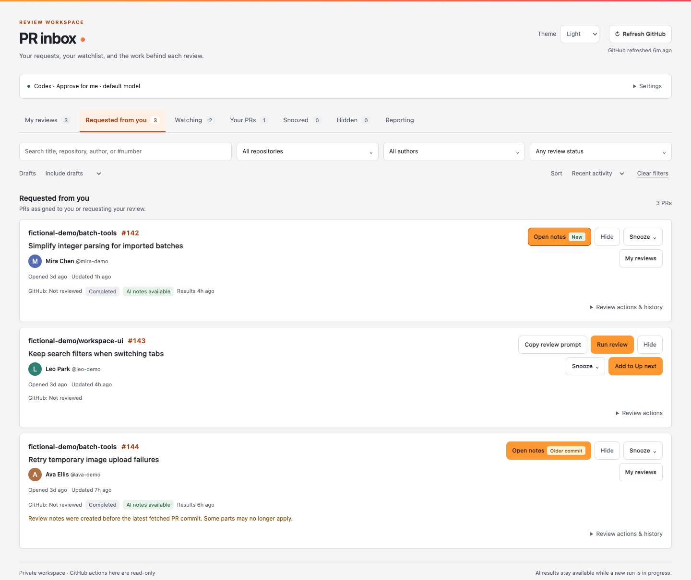
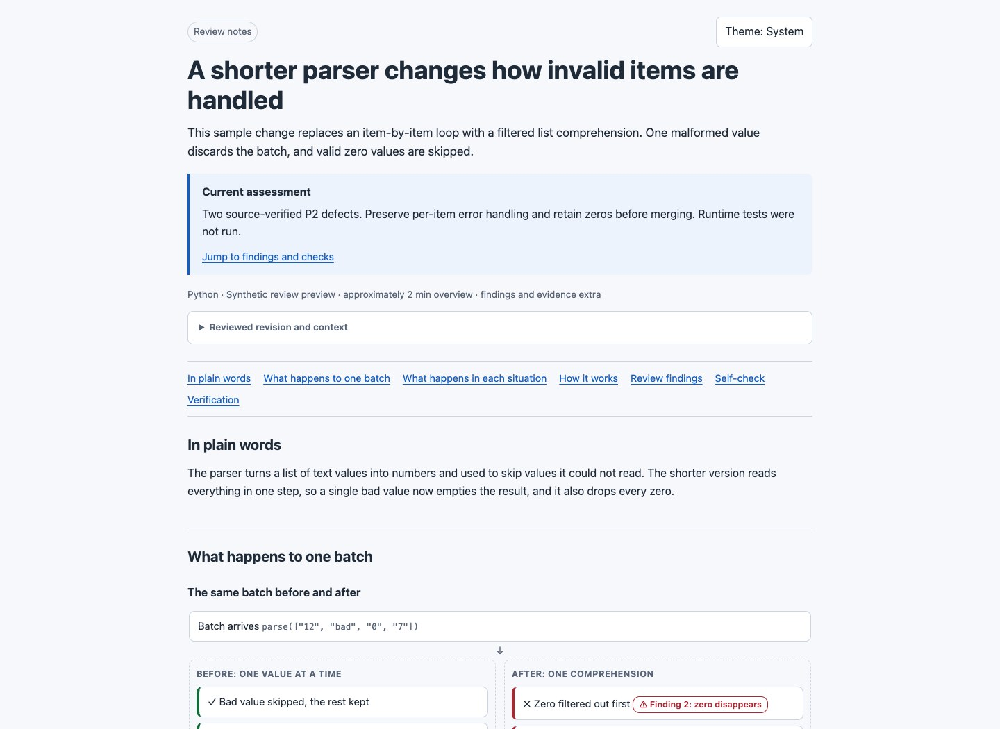
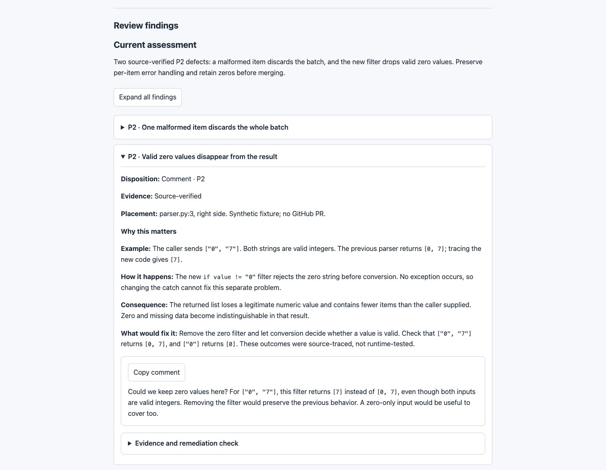
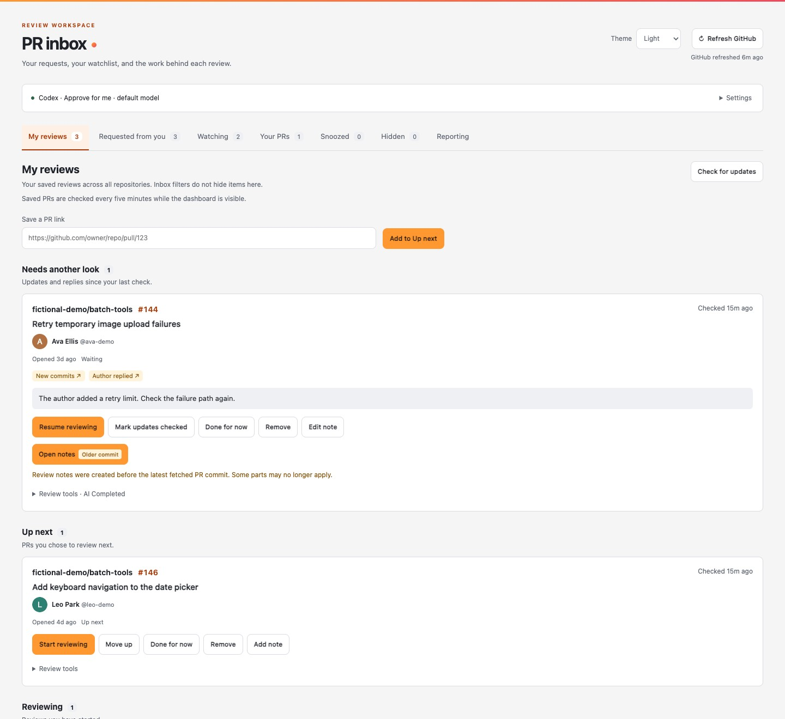
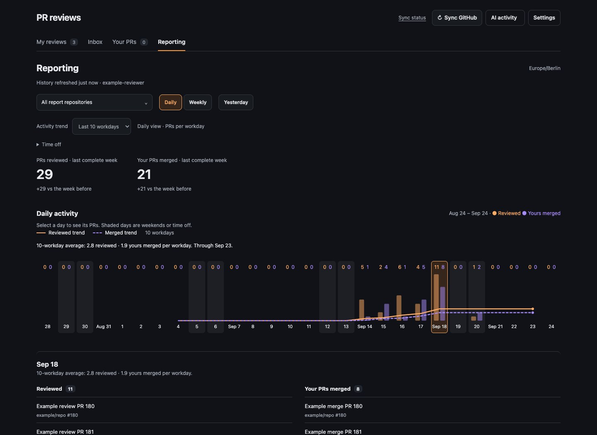

# PR Review Skill

A local workspace for reviewing GitHub pull requests with an AI coding agent.
Keep track of what needs your attention, read an explanation of a change,
and turn verified findings into review comments you can edit and send yourself.

The dashboard runs on your machine. Python serves the app; the frontend is
plain HTML, CSS, and JavaScript. There is no frontend build step or database
service to set up.

## A look around

**Your review inbox, in light mode.** See authors, filter your queue, and open
one combined review report from the PR card. Snooze a PR or save it to My reviews.



**One report, starting with the explanation.** Follow a concrete before/after
example and see the exact code behind the behavior.



**Findings you can explore one at a time.** Severity and titles stay visible.
Open a finding for an example, the cause and consequence, a fix direction, a
copyable comment, and its evidence. Expand all when you want the full review.



**My reviews.** Keep a personal queue and pick up where you stopped. New commits
and replies move saved PRs into Needs another look.



**Reporting, in dark mode.** Compare completed weeks and select a day or week
to see which PRs you reviewed and which of your own PRs were merged.



All screenshots use fictional PRs, people, repositories, and activity, with
synthetic avatars. They were captured from the dashboard and report
renderer on September 15, 2026, using an isolated demo with mocked data.
See [screenshot provenance](docs/screenshots/README.md).

## What it does

- **Triage:** separate views for review requests, watched repositories, your
  own PRs, snoozed PRs, and hidden PRs. Snooze for one day, two days, or a
  week; hide a PR with an undo option.
- **Estimate effort:** optional background AI estimates show Quick, Moderate,
  Involved, or Uncertain with a short explanation. Filter for quick reviews or
  sort by effort, and rate estimates after your normal reviews. A compact
  indicator appears while estimating and hides when finished. AI activity keeps
  detailed progress and daily usage; failures and blocked work remain visible.
- **Follow up:** save PRs in My reviews, keep private notes, and see new commits
  and replies that need another look.
- **Filter:** include or exclude multiple authors, repositories, and review
  statuses. There is a shortcut to exclude Renovate. Preferences are remembered
  in your browser.
- **Review:** launch Claude Code or Codex CLI from the dashboard. Keep the
  combined HTML review notes and run history attached to the PR.
  Existing results remain available during a rerun; outdated results are marked.
- **Understand and check:** the opening shows the changed outcome and current
  assessment, with a shortcut to findings. One HTML contains the explanation and
  expandable, verified findings with examples and draft comments. The lead
  assesses size, complexity, risk, and uncertainty before allocating reviewers;
  the verification appendix records coverage, checks, limitations, and model choices.
- **Report:** daily and weekly GitHub activity, completed-week comparisons,
  and a short list of yesterday's work. A PR counts once per day or week.
  AI runs, draft reviews, and ordinary PR comments do not count as submitted
  GitHub reviews.
- **Sync:** one Sync GitHub action updates discovery, saved reviews and reporting.
  Open the sync status for source timestamps and any failures. Cached results stay available.
- **Settings:** review agents, effort estimates, watched repositories and appearance
  are available from every view. Choose light, dark, or your system theme.

## Requirements and current scope

- Python 3.11 or newer, Git, and the [GitHub CLI](https://cli.github.com/).
- A GitHub login with access to the repositories you want to review.
- macOS for Claude review launches, which open Terminal. The Python backend
  uses Unix facilities; Windows support is not provided.
- Claude Code installed and authenticated for Claude reviews, or the pinned
  `openai-codex` runtime from `requirements-triage.txt` and an existing Codex
  login for in-app Codex reviews.

Background effort estimates use the optional Python dependencies in
`requirements-triage.txt`. Install them into `.venv`, then configure
Settings → Effort estimates. Codex Python SDK uses your existing login;
OpenAI API uses `OPENAI_API_KEY` from the server environment and separate billing.
Initial estimates run after GitHub refresh or Estimate all waiting, continuing
through eligible inbox and active My reviews PRs until caught up or the daily
limit is reached. Estimate effort on a card also supports an explicit draft
estimate; automatic runs skip drafts. Hidden and snoozed PRs are excluded.
Completed estimates are retained when a PR changes and marked Outdated; use
Re-estimate on its card to update one manually. Incomplete
diffs are marked Uncertain. See [effort configuration and limits](references/dashboard.md#initial-review-effort).

Before adopting this workflow, review the customization notes below.
The inbox and reporting can be used without running an AI agent.

### Full-review dependencies

The combined report renderer and neutral comment-writing guidance are bundled.
No additional skill is required. You can optionally configure your agent to use
a personal writing-style skill, such as `my-feedback-voice`, for draft comments.
Without one, reviews use clear, collegial wording. Keep personal writing examples
outside this repository.
Read [SKILL.md](SKILL.md) for the complete review and sandboxed verification
workflow. An agent needs a suitable disposable sandbox to execute PR code.
Full report validation also needs Node.js, Playwright, and an available
Chromium or Chrome browser. See [renderer and browser-check setup](references/authoring.md)
for the commands and runtime-path overrides.

## Get started

Clone into the shared skill directory used by this installation:

```sh
git clone https://github.com/robert-northmind/pr-review-skill.git \
  ~/.agents/skills/pr-review
cd ~/.agents/skills/pr-review
gh auth login
python3 scripts/pr_server.py
```

While the repository is private, cloning requires authenticated repository access.
If you already have this checkout, use it instead of cloning over it.

Open [the local dashboard](http://127.0.0.1:8765/) and click **Refresh GitHub**.
Leave the server running in that terminal; Ctrl-C stops it. If the port is occupied, start with
`python3 scripts/pr_server.py --port 8766` and open that port instead.

In **Settings**, add watched repositories as `owner/repository`, then select Sync GitHub
GitHub. Choose the agent used for reviews; blank model and effort fields use
its CLI defaults. Model and effort are saved separately for each agent.
These settings select the lead session. The lead chooses reviewer subagent
models and reasoning levels from the host's supported options, within your
explicit constraints. If overrides are unavailable, reviewers inherit the
session settings and the report records that limitation.

### Run a review

Make this skill discoverable by your agent. Skill search
paths depend on the agent; placing the folder here alone does not configure
every CLI. You can also give an agent the explicit instruction:

```text
Read ~/.agents/skills/pr-review/SKILL.md and run a full review of
https://github.com/OWNER/REPOSITORY/pull/123.
```

From the dashboard, click **Run AI review** to generate the combined report.
Codex runs in a background worker with live progress inside the dashboard.
Claude opens an interactive Terminal session. Both use the skill prompt and
the selected agent's authentication. Use **Copy review prompt** to paste the
same instructions into another agent session.

The agent records progress and artifacts in the local tracker. When finished,
click **Open notes** on the card. There is one report and one review skill:

1. **Understand the change:** purpose, essential context, a concrete before/after
   example, and exact source excerpts.
2. **Read the assessment and findings:** each finding starts collapsed with its
   severity and title visible. Open it for expected versus actual behavior, why
   it happens, why it matters, the proposed fix, evidence, and a copyable comment.
   Multiple findings have **Expand all / Collapse all** controls.
3. **Check the verification appendix:** inspected scope, checks and outcomes,
   unresolved gaps, and reviewer allocation with requested versus known effective
   model and effort settings.

The workflow covers the full diff with correctness, security, and contract
review lenses, then verifies candidates before reporting them. Model selection
is an adaptive policy, not a guarantee of review quality. See the
[review approach](references/review-practices.md) and
[allocation policy](references/reviewer-allocation.md).
Review comments are drafts; read and edit them before posting them yourself.

### Keep track of your reviews

Click **Add to Up next** on a PR or paste its link into **My reviews**. Move it
through **Up next**, **Reviewing**, and **Waiting**, and leave a private note
about what to check next. New commits or relevant replies appear in
**Needs another look**. **Mark updates checked** acknowledges the displayed
updates; opening a PR alone does not clear them.

**Waiting for author** keeps the PR tracked after your feedback. New commits or
relevant replies move it to **Needs another look**. **Remove from My reviews**
stops active tracking and offers Undo; use Add PR to follow it again later.
Completing an AI run does not submit a GitHub review or finish your work.

GitHub sync automatically places confirmed closed/merged PRs in **Merged or
closed**, sorted by latest activity. Open PRs you commented on or reviewed are
followed in Waiting for author unless already tracked or explicitly removed.
Closed/merged entries, reports, private notes, code conversations and PR caches
expire 20 days after GitHub's close/merge date, on the next successful check.
Running work and cleanup failures defer deletion and show an error.
Reporting keeps its separate activity window.

Saved PRs and participation history are checked every five minutes while the dashboard is visible.
There are no checks or notifications while the page is closed.

### See your activity

Open **Reporting** and click **Sync GitHub**. The report
covers four complete weeks and the current week, using Europe/Berlin dates.
Switch between **Daily** and **Weekly**, select a chart bar, or click
**Yesterday** to see the associated PRs. Reporting has its own repository
filter; hiding an inbox PR does not remove it from your activity.

Daily bars include separate review and merge trend lines. **Activity trend**
uses the last 10 complete workdays by default; select 5 for a faster-moving
average. Weekends and dates marked under **Time off** are excluded, while
zero-activity workdays count. The line stays flat across excluded days and
starts once a full window is available. Today and the last synced day remain
outside the average until a later sync confirms their full activity.

Time off accepts an inclusive date range; use the same start and end for a
single day, or **Remove** to include those weekdays again. These preferences
are saved in the current browser. Bars and weekly totals retain all activity,
including PRs reviewed or merged on excluded days. Trend values are daily
averages; weekly counts remain distinct PRs for the week.

## Personalize the installation

- Set `PR_REVIEW_LOCAL_DEV_ROOT` to the directory containing your existing clones.
  It defaults to `~/Development` and is used as a checkout discovery hint.
- Optionally configure a writing-style skill in your agent for personalized comments.
- Reporting's Europe/Berlin timezone is currently fixed in the backend and UI;
  it is not a dashboard setting.
- For automatic startup on macOS, generate a launchd plist for your installation
  using [the service setup instructions](references/dashboard.md#automatic-startup-on-macos).
  Running the server manually is sufficient to get started.

For example, start with a different checkout directory:

```sh
export PR_REVIEW_LOCAL_DEV_ROOT="$HOME/Projects"
python3 scripts/pr_server.py
```

`PR_REVIEW_TRACKER_HOME` selects the state directory. `PR_REVIEW_PYTHON` selects
the Python interpreter for background workers. Set these before starting the
server or generating its launchd configuration.

## Local data and privacy

State and review runs live under `~/.local/share/pr-review-tracker/`; generated
review files live separately from this Git repository. The
`PR_REVIEW_TRACKER_HOME` environment variable selects an alternate tracker
home, which is useful for isolated testing. Use the provided commands instead
of editing registry JSON by hand.

The dashboard runs on your machine, but AI features send data off your machine:

- **GitHub sync:** reads PR information using your GitHub login. Author avatars
  normally load from GitHub.
- **AI features:** send PR descriptions, code/diffs, and your questions to the
  selected AI provider as needed. Effort estimates also send descriptions and
  patches. Only enable these features for repositories you are allowed to share
  with that provider.
- **Saved copies:** review reports, downloaded source, notes, and chat data can
  remain in the tracker directory. Persistent Codex conversations also use
  Codex-managed history outside that directory. Deleting tracker files does not
  delete Codex history or copies retained by a provider; manage those separately
  through the relevant product's data controls.

The server listens only on your machine's loopback interface. Treat generated
reports and screenshots as potentially containing private code and review data.

Dashboard GitHub operations are read-only: they do not post comments, approve,
or merge PRs. The skill uses isolated checkouts and requires sandboxed execution
for PR code. Runtime history and generated review artifacts are not included
in this repository's Git backup. Keep those out of commits and screenshots.

## In-app Codex reviews

Selecting Codex runs AI reviews in a background worker and opens live activity
in the dashboard. Stage progress follows reviewer checkpoints; it is an estimate,
not time remaining. Reviews keep running across page reloads and server restarts.
Stop review cancels the worker and preserves its saved activity. Claude still
opens Terminal. Full-review sessions do not accept follow-ups; the code workspace
has a separate persistent chat for code questions.

Install `requirements-triage.txt` into the server's Python environment for Codex
reviews. See [dashboard operations](references/dashboard.md#in-app-codex-reviews)
for isolated state, progress reporting, and validation.

## Code review workspace

**Open review** opens a workspace with AI review and Code changes tabs. Explore
unified or side-by-side diffs, expand context, open full files, and save viewed
progress. Checking for new commits resets viewed status only for changed file
comparisons. Private notes and revision-labeled conversations are saved locally.

Select lines to focus a question, then let Codex investigate beyond the selection.
Each conversation uses a persistent Codex thread and an isolated Git checkout at
the PR's pinned revision. Codex can search unchanged source, inspect the base
version, search public documentation, and read relevant private GitHub issues,
PRs and comments through your existing `gh` login. Streamed answers, activity and
source links appear in the conversation. Follow-ups resume the same Codex thread.

Chat uses the local Codex login and dashboard model profile. It starts with a
read-only filesystem sandbox; Codex automatic approval review handles requested
permission escalations. Review instructions prohibit edits, repository execution,
tests and GitHub writes. Native shell commands are enabled for source and GitHub
reads. Public web search is separate from authenticated GitHub access.
Finished HTML reviews stay in the dashboard; completion does not open an external
browser. See [workspace architecture, limits and tests](references/code-workspace.md).

## Development and recovery

Runtime helpers and public commands live in `scripts/`. Regression tests live
in `tests/python/`, `tests/javascript/`, and `tests/browser/`; disposable browser
servers and synthetic data live in `tests/fixtures/`. `assets/` contains the UI
and report resources, and `references/` contains the skill's detailed guidance.

Run all regression suites from the repository root:

```sh
python3 tests/run.py
```

The runner stops on failure. Python tests use the invoking interpreter;
JavaScript and browser tests require Node.js. Browser tests also require
Playwright and Chrome. Install Playwright in an external development environment
and set `PR_REVIEW_PLAYWRIGHT_MODULE` to its absolute module path if it is not
available through normal Node resolution. `PR_REVIEW_BROWSER_CHANNEL` defaults
to `chrome`. Browser fixtures use the runner's interpreter unless `PYTHON` is
set; `NODE` can select a different Node.js executable.

Run individual suites or focused Python checks:

```sh
python3 tests/run.py python
python3 tests/run.py javascript
python3 tests/run.py browser
python3 tests/run.py python test_reporting test_dashboard
python3 tests/run.py python --pattern 'test_code_workspace*.py'
```

The runner resolves paths from its own location, so it also works when invoked
by absolute path from another directory. To use unittest directly, run
`PYTHONPATH=scripts python3 -m unittest discover -s tests/python -p 'test_*.py'`
from the repository root. Individual JavaScript/browser files can be run with
`node tests/javascript/test_reporting.cjs` or
`node tests/browser/test_inbox_review_browser.cjs`.

Tests use disposable state and local servers. HTTP and browser checks need
loopback access; macOS sandbox integration checks need permission to launch
`sandbox-exec`. Fixtures can also be started directly, for example
`python3 tests/fixtures/workspace_integration_fixture.py --port 8879`.

Reload the page after asset changes. Restart the server after Python changes.
See [dashboard details](references/dashboard.md),
[review-note conventions](references/review-notes.md), and
[Git recovery instructions](RECOVERY.md) for more.

### Commit identity and security checks

Git stores an author's and committer's email in each commit. To use a different
address for future commits, set repository-local `user.email` to your chosen
public address or GitHub noreply address. You can also set `GIT_AUTHOR_EMAIL`
and `GIT_COMMITTER_EMAIL` in the shell that creates commits. Git stores the
resolved addresses, not the environment-variable names. Neither method changes
existing commits or annotated tags; those need a separate history rewrite or
a fresh public repository if their identity metadata must remain private.

Security checks run on pushes, pull requests, and manual workflow dispatches,
with read-only repository permissions and actions pinned to commit hashes:

- **Secret scan / gitleaks:** Gitleaks 8.30.1 scans all fetched history with
  redacted output.
- **Secret scan / trufflehog:** TruffleHog 3.97.5 scans the history reachable
  from the checked-out commit, including the PR merge commit on pull requests.
  It fails on detected secrets with credential verification disabled, so
  candidate credentials are not sent to external providers. The CI filter ignores
  only the exact intentional URL fixture in the renderer/workspace tests and
  their historical paths. Other findings and scan errors fail the job; raw
  credential values are not printed in the job output.
- **Workflow security / zizmor:** zizmor 1.30.1 audits GitHub Actions workflows,
  fails on findings, and adds job annotations. It does not require GitHub
  Advanced Security or write permissions.

Run the scanners locally with the versions above:

```sh
gitleaks git . --log-opts="--all" --redact --no-banner
# Also check new and uncommitted files before committing:
gitleaks dir . --redact --no-banner
set -o pipefail
trufflehog git "file://$PWD" --branch HEAD --no-verification --fail-on-scan-errors --no-update --json \
  | python3 .github/scripts/check_trufflehog.py
zizmor .github/workflows
```

For TruffleHog findings, run the scan locally without the pipe to inspect its JSON
output; do not paste raw results into issues or CI logs. If scanning a linked Git
worktree fails, scan a disposable regular clone instead.

A scan failure needs investigation. Revoke any real credential, remove it from
the affected history when necessary, and rerun the check. CI runs after a push;
use local scans and GitHub push protection to catch secrets before they reach
the remote. Scanners do not detect every kind of private information, so review
screenshots, examples, and generated artifacts before committing them.

## License

[MIT](LICENSE), copyright © 2026 Robert Magnusson.
You may use, modify, distribute, and sell copies, including in commercial
projects, while retaining the copyright and permission notice. The software
is provided without warranty. See the license for the complete terms.
